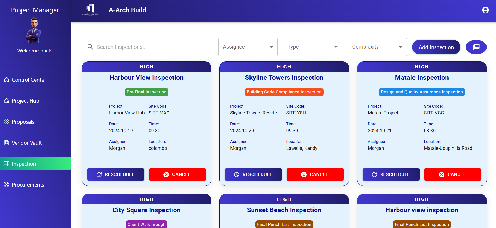
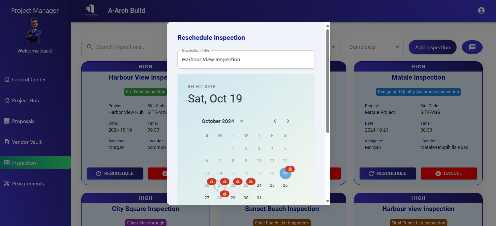
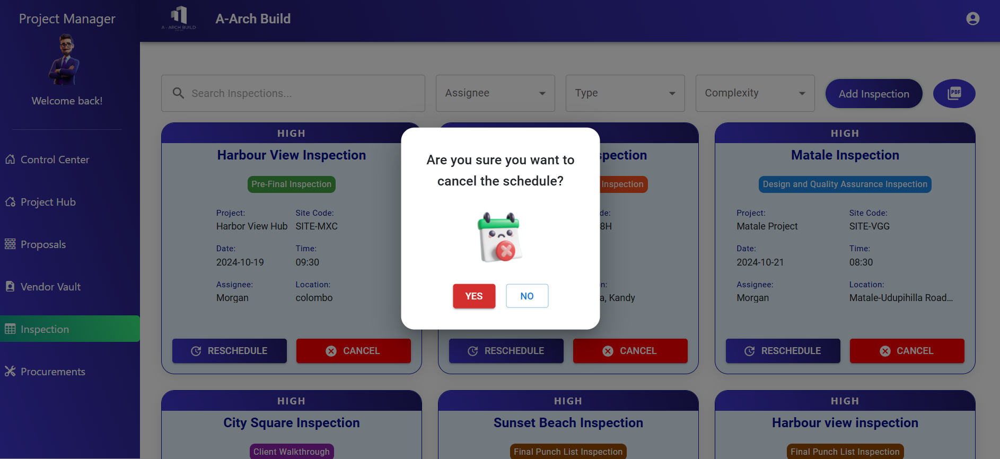
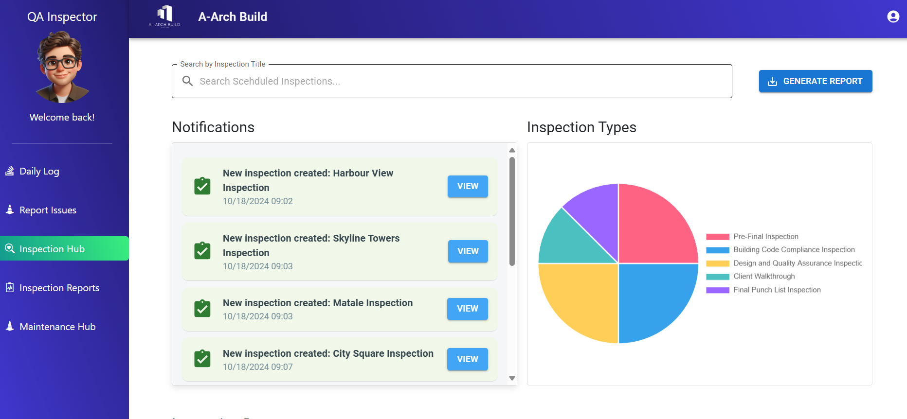
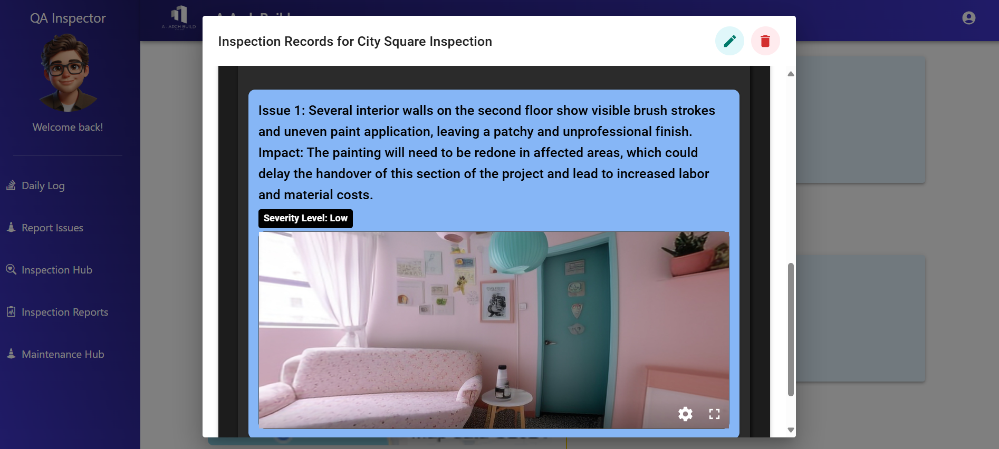
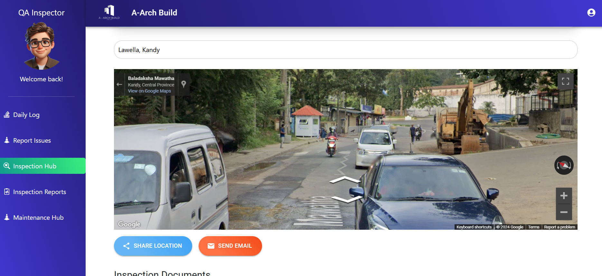

# 🏗️ A-Arch Build - Inspection Feature

The **Inspection** feature in A-Arch Build offers a robust system for managing all stages of construction inspections. From scheduling to recording and generating reports, this module streamlines inspection workflows, making project management more efficient and transparent.

## 🔧 Features

### 1. 📅 Inspection Scheduling by Project Manager
Project Managers can easily schedule inspections for specific projects, assign dates, times, and inspectors, ensuring timely reviews of each site.

### 2. 🔄 Inspection Rescheduling and Deletion
Inspections can be easily rescheduled or deleted, allowing flexibility for any changes in the project timeline or unforeseen events.

### 3. 🔔 Inspection Notification for Assignee's Dashboard
Once scheduled, assigned team members receive real-time notifications on their dashboard, keeping them informed of upcoming inspections.

### 4. 📝 Inspection Recording, Viewing, Updating, and Deleting
During inspections, team members can:
   - Record issues, upload images, and log essential details.
   - View uploaded images with a **360° view** for enhanced clarity.
   - Update or delete inspection records as needed.
     

### 5. 📊 Dynamic Report Generation
Generate **customizable inspection reports** dynamically, filtering specific criteria and generating reports based on the inspection details. These reports are downloadable in PDF format, making documentation and communication streamlined.

### 6. 🗺️ Map Integration for Location Tracking
Inspections are tied to their physical locations through an integrated map feature, allowing users to view and verify site locations during scheduling and recording. This ensures accurate and efficient site management for inspections.

---

## 🛠️ Tech Stack

- **MongoDB**: Stores inspection data and records.
- **Express.js**: Backend framework to manage API requests for inspections.
- **React.js**: Frontend framework for scheduling, recording, viewing inspections, and generating reports.
- **Node.js**: Manages the backend logic for inspection workflows.
- **Google Maps API**: Used for integrating maps to display and track project locations.

---

## 📝 Contributions

This module is part of the larger A-Arch Build project developed by a group of 7 members for our second year project

